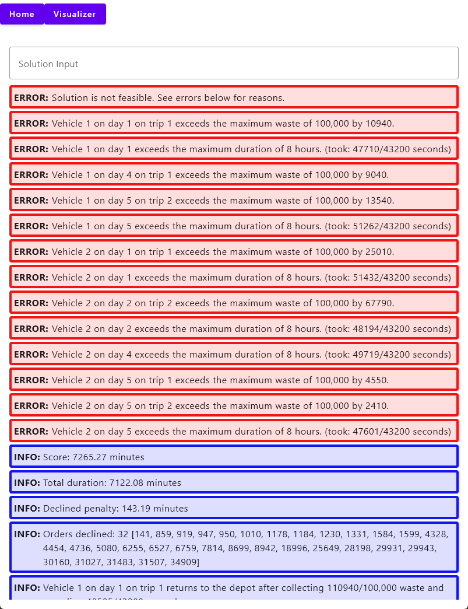
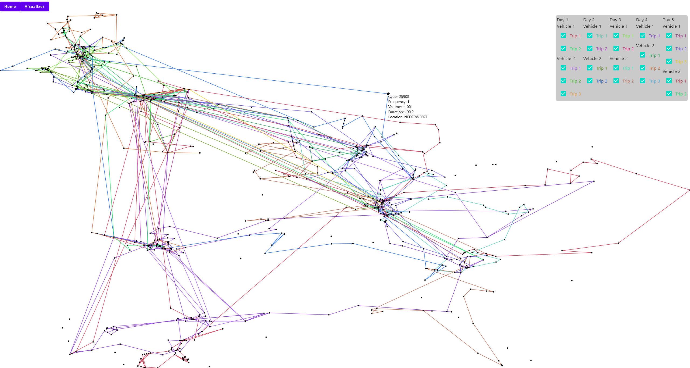

# Checker

Here is a simple checker for the OPCO "grote opdracht" of the course "Optimalization and Complexity"
at [Utrecht University](https://www.uu.nl/). The checker is written in Kotlin using the Kotlin Multiplatform framework.

## Usage

You can use the checker online at [https://sybsuper.github.io/Checker/](https://sybsuper.github.io/Checker/) (zooming
currently is not working properly in the web version).
Alternatively the checker can be run locally by downloading the latest release from
the [releases page](https://github.com/Sybsuper/Checker/releases).

## Screenshots

### The main input screen

### The visualizer
